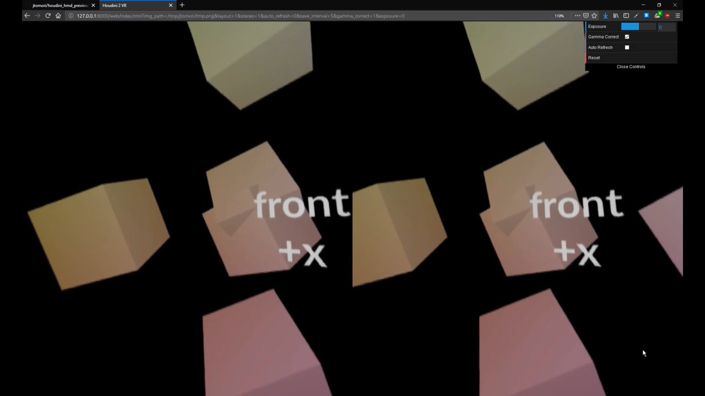

# Houdini 2 VR
## Preview your Houdini mono/stereo VR renders in VR headset
This tool takes displayed image plane in Render View pane and displays it in your VR headset. 

Note that this tool can be used also without a headset. In this case it will be displayed as a panorama image.

Check *Houdini 2 VR* in action:
[](https://youtu.be/B5eOd3h8jAc)

And you can read [blog post](https://jurajtomori.wordpress.com/2019/03/23/houdini-2-vr/) introducing this tool.

<br>

### Setup
* Add this repository into **HOUDINI_PATH** environment variable (e.g. in *houdini.env* file)
    ```
    HOUDINI_PATH = &;/home/juraj/Work/houdini_hmd_preview/
    ```
* Show **Houdini 2 VR** shelf

<br>

### Shelf tools
* **Save as PNG** - saves rendered image as *$HIP/tmp/tmp.png*
* **Start auto save** - starts auto-saving thread at a specified time interval *(specified in `hou2vr.py`)*
* **Show in browser** - opens a web browser with rendering image
* **Stop auto save** - stops auto-saving thread

<br>

### Supported renderers, devices
This tool can support any renderer plugin which can render into Houdini's **Render View** pane. It has been tested with the following renderers:
* Mantra
* Arnold
* Redshift
    * *Note: you need to make sure that **Linked ROP** parameter on your **Redshift_IPR** node is pointing to the corresponding **Redshift** node.*

You can read about supported browsers and HMDs [here](https://webvr.rocks/).

If your renderer is missing then let me know, it can be easily added.

<br>

### Future work
* Send values from Houdini directly to browser (to skip image saving/loading times) and support HDR images
    * using websockets?
    * would solve problem with loading partial frames (unfinished saving)
* Different way of reloading image texture
    * to address short black-outs between page reloads
    * re-assigning a texture? (and kill its cache first)
* Move saving at Houdini side to a separate process - to minimze lags in Houdini UI
    * using shared memory?

<br>

### Limitations & Bugs
* With automatic refreshing there are short black-outs between page reloads
* Sometimes browser loads image which is not fully written to drive, therefore it displays only a part of it
* HDR renderings are currently clamped because of transfering them as a PNG file

<br>

### Contributing
Feel free to contribute to this project by creating pull requests or by [buying me a beer :)](https://www.paypal.me/jtomori)
